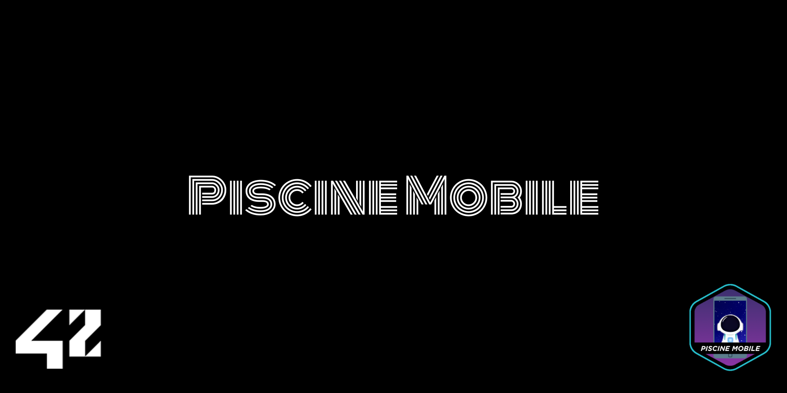

# Piscine Mobile
### Here you will see the mobile applications I made during the Mobile Project. There are three main apps, a Calculator, a Weather App, and a Diary App, their final version are in the `final apps/` directory. The other apps and progression are in the `progress/` directory.


> This project counts as a `42.Zip Specialization`


# TESTING APPS
## Requirements
#### - First of all, you will need the app `Expo Go` if you are an Android user, IOS users may use the iPhone camera to scan the QR Codes.
#### - Linux, macOS or Windows with WSL installed
#### - Node
### 1 - Clone this repository
```bash
git clone https://github.com/vgomes-p/piscine-mobile-42.git
```

### 2 - Get into the project dir
```bash
cd piscine-mobile-42
```

###
### 3 - Get in the app file you want to test and run the following command in the terminal:
```
npm install
```
### 4 - When npm finish installing all dependencities, run the following command in the terminal:
```
npx expo start
```
### and read the QR Code with you `Expo Go` or `Camera` app.